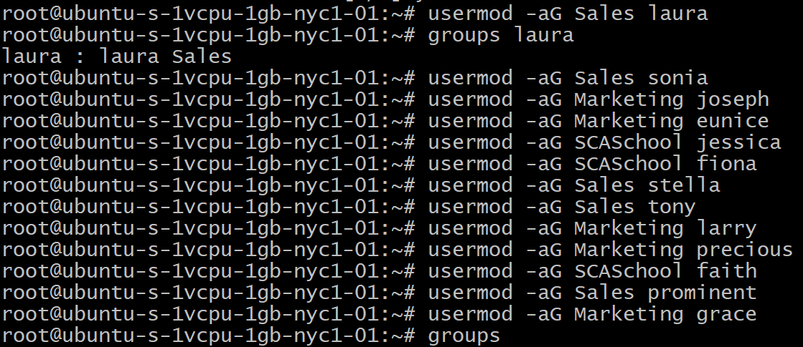
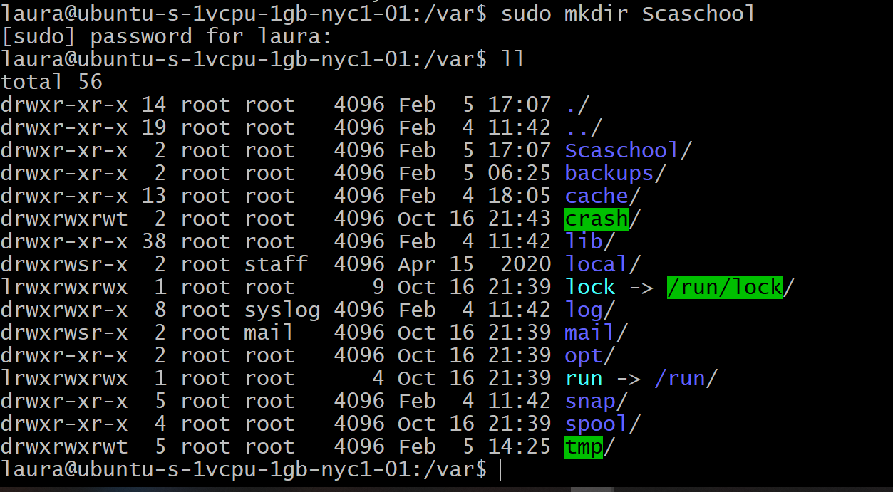
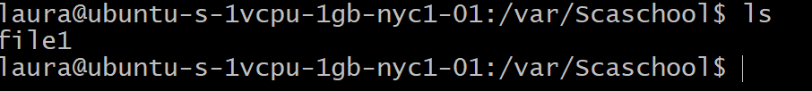

# SCA WEEK ONE TASK

This readme very clearly describes the test process and it's output, it also shows the instructions and documentaion used in this task.

**Creating fifteen users on my VM, this command was used**

*adduser the-name-of-user*

**Creating 3 groups, this command was used**

*groupadd group-name*

**To see group created, this command is used**

*cat /etc/group*

**Assigning users to the groups created, this command was used**

*usermod -aG name-of-group user*

**To demonstrate that user(s) in a group cannot access files/folders that belong to another group unless they are added to that group, the illustration below is provided**

A user (user laura) is given sudo access, the *visudo command lets you edit the sudo files*, in the file below you would see that the admin has access to all files;

Hence the user (user laura) is added to group admin; using usermod command, hence this user can use the sudo command, shown below;

Explaining futher;
*Note: drwx - directory, read, write, excecute*
A directory (Scaschool) is created in directory var, it is shown below that; *User root can read, write and execute*
*Group root can read and execute but not write*
*others can read and execute but not write*

Firstly group root is given access to write with the command as shown below;

*sudo chmod g+w directory*

If the user tries to access Scaschool folder which belongs to group root, this action will be denied as shown below;

The user can only have access to the folder if group root adds the user to the group, shown below;

Now the the user is in group root, access to the group folders/files is possible, as show below, user laura created a plain text file in the Scaschool folder;

